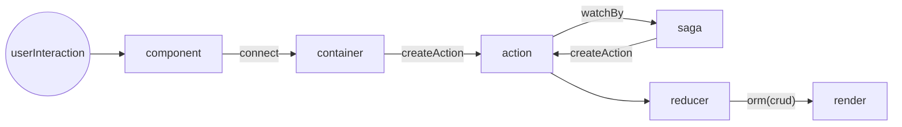
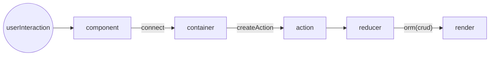

# todo

1. 数据修改部分要工具
1. actionCreater要工具
1. 常量生成工具
1. 一些数据流有点疑问
1. checkbox uncontrol&control
1. URL fetch fetchjsonp等polyfills问题

## from user interaction to render

1. long

```mermaid
graph LR;
    userInteraction((userInteraction))-->component
    component--connect-->container
    container--createAction-->action
    action--watchBy-->saga
    saga--createAction-->action
    action-->reducer
    reducer--"orm(crud)"-->render

```

1. short

```mermaid
graph LR;
userInteraction((userInteraction))-->component
    component--connect-->container
    container--createAction-->action
    action-->reducer
    reducer--"orm(crud)"-->render

```
